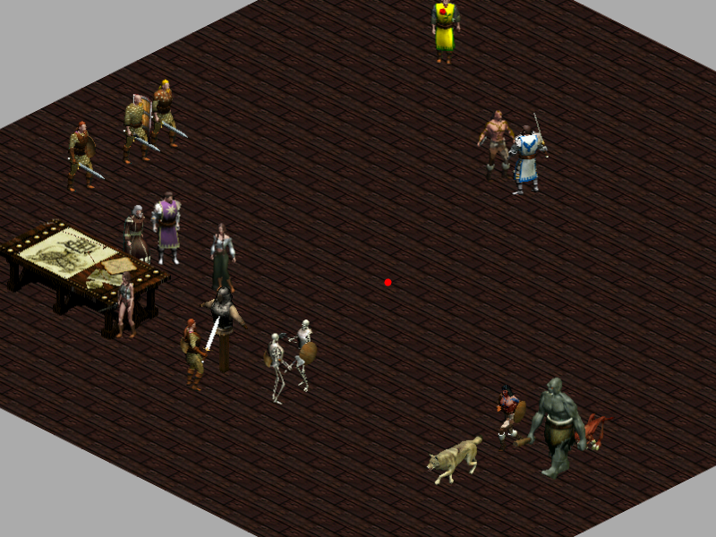

Siege of Avalon : Open Source : Phaser + Electron
-------

The aim of this fork is to help game developers, who are proficient in JavaScript, to start on a new desktop engine that uses the game assets.

I haven't even included Electron at this point. I think it should be added in the end. So far the fork includes only several lines of code that read the proprietary POX files and animate characters and monsters.

Since I will not have time to work on the engine, hopefully someone with more time and enthusiasm will use this fork to create the new [Freeablo](https://freeablo.org) or [FOnline](https://www.fonline-reloaded.net/).

 `yarn build`
 
 `yarn start`
 
 `yarn dev`

Screenshot:

Siege of Avalon : Open Source
-------

The aim of this project is to port the original Win32 Delphi code, over to C# using MonoGame and XNA, so that it can be enjoyed by more people. When complete the plan is to release on Windows Phone, iOS, Android, MacOS, Linux and via PlayStation Suite (PS Vita, Xperia phones and eventually PS3).

If you are an ex-Delphi developer and fancy writing a flexible 2.5D isometric engine in C# using XNA, this is your opportunity. The beauty is that assets already exist, so once the game engine is done, it should hopefully be fairly easy to integrate the assets.

License
-------
You are NOT permitted to rip any of the assets (image, sound, levels or anything else) from this project, 
nor are you permitted to rebadge this game and sell it as your own.
It MUST remain opensource for everyone to enjoy freely.
You agree to contribute back to this awesome game should you make any bug fixes/enhancements.

By downloading the source, you hereby agree to the aforementioned license.
